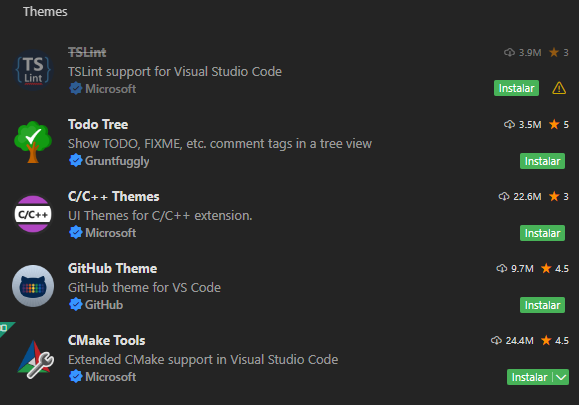
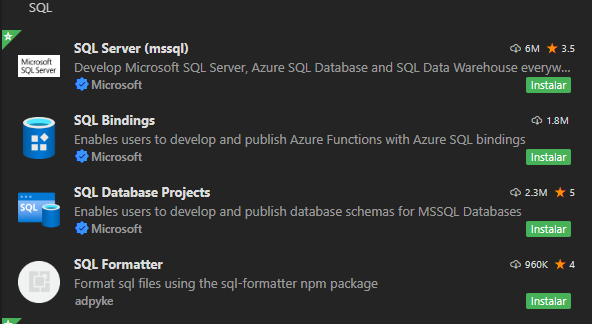
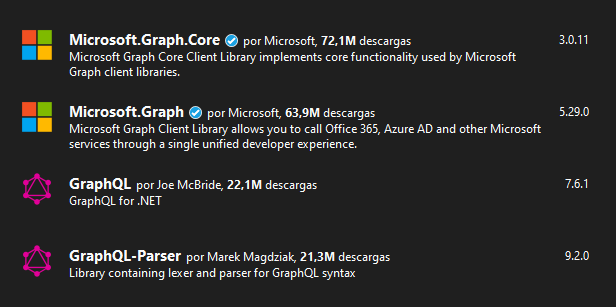
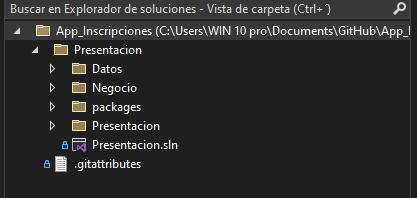

# Configuración de las herramientas de desarrollo

**Ya instaladas las herramientas de desarrollo, la configuracion de estas puede
variar segun cual herramienta se este utilizando pero en general se realizan los
siguientes pasos:**

- **Configuración Básica**: Una vez instalada la herramienta, es posible que se
  necesite realizar una configuración inicial. Esto puede incluir la elección de
  un tema de color, configuración de atajos de teclado etc.

  

- **Pluggins**: Si se esta usando un editor de código como visual studio code,
  es posible que se necesite hacer la instalación de ciertas herramientas o
  'pluggins' que nos brindan la capacidad de realizar acciones que el editor de
  código no posee nativamente.

  

- **Librerias**: Si se esta usando un entorno de desarrollo como Visual Studio,
  este si posee la capacidad de realizar diversos procesos complejos, como por
  ejemplo, conexion a una base de datos pero para esto es necesario instalar las
  librerias adecuadas, estas se instalaran directamente en el proyecto en el
  cual nos encontremos trabajando.

  

- **Configuración de Proyecto**: Si se esta usando un entorno de desarrollo
  integrado (IDE), es importante configurar el proyecto correctamente. Esto
  puede implicar la creación de un nuevo proyecto, importación de código
  existente o configuración de rutas de archivo.

  
