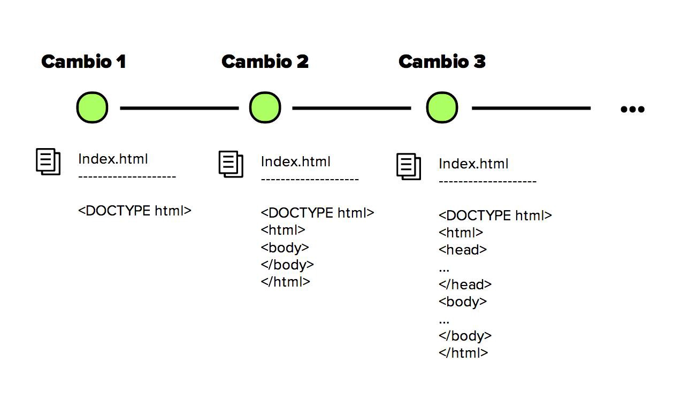

# Selección de herramientas de versionamiento

## ¿Qué es una herramienta de versionamiento?

Hablando puntualmente de desarrollo de software, es un software que permite a
los desarrolladores gestionar y rastrear las diferentes versiones del código
fuente, es decir, las diferentes implementaciones que se le hacen a un proyecto
o aplicativo

---

Exiten varios de estos softwares los cuales son:

- Git

- Subversion (SVN)

- Mercurial

- Mercurial

- TFS (Team Foundation Server)

entre otros.

**La elección de esta herramienta dependera de las necesidades del proyecto.**

## GIT

Creado por Linus Torvalds en 2005, Git se utiliza para rastrear los cambios en
el código fuente de un proyecto a lo largo del tiempo y para facilitar la
colaboración en equipos de desarrollo.

### Caracteristicas importantes:

- **Distribuido**: Git es un sistema de control de versiones distribuido, lo que
  significa que cada desarrollador tiene una copia completa del repositorio en
  su máquina local. Esto permite trabajar de forma independiente y sin conexión
  a internet, lo que luego se puede sincronizar con un repositorio remoto.

- **Historial de Versiones**: Git registra cada cambio realizado en el código,
  lo que permite ver el historial completo de versiones del proyecto. Esto
  incluye quién hizo el cambio, cuándo se realizó y qué se modificó.

- **Ramificación y Fusión**: Git permite la creación de ramas (branches) para
  desarrollar características o correcciones de errores de forma independiente.
  Luego, estas ramas se pueden fusionar (merge) de nuevo en la rama principal
  cuando estén listas.
